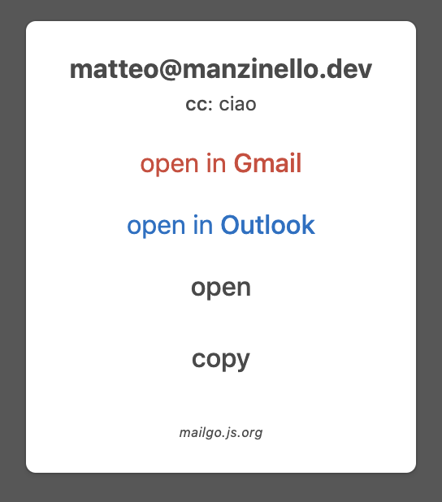

# 💌 mailgo - a different mailto (WIP)


(see it in action! <https://mailgo.js.org>)

## what?

mailgo will substitute all the `mailto:` links with the **mailgo modal**, in less than 7KB

[](https://cdn.jsdelivr.net/npm/mailgo@0.2.2/dist/mailgo.min.js)



---

## installation

add at the end of the `<body>`

```
<body>
...
<script src="https://unpkg.com/mailgo@0.2.2/dist/mailgo.min.js"></script>
</body>
```

you can also import mailgo in `<head>` using `defer`

```
<head>
...
<script src="https://unpkg.com/mailgo@0.2.2/dist/mailgo.min.js" defer></script>
</head>
```

(note: the GitHub `/dist` is totally unstable, use `unpkg` or `npm` to test **mailgo**, thanks!)

---

## usage

### default

**by default all the `mailto:` links will be enabled with mailgo only importing the script!**

(and with the default usage in the modal will appear also cc, bcc, subject and body parameter if provided)

Do you want to prevent the spam? Use a _no-spam usage_ instead the default usage

### no-spam usage #1 (recommended)

`<a href="#mailgo" data-address="matteo" data-domain="manzinello.dev">write me!</a>`

- add `href="#mailgo"` to `<a>`
- add `data-address` and `data-domain` to re-create your email address

### no-spam usage #2

`<a class="mailgo" data-address="matteo" data-domain="manzinello.dev">write me!</a>`

- add `class="mailgo"` to `<a>`
- add `data-address` and `data-domain` to re-create your email address

#### exclude a mailto

to exclude a mailto link add to the `<a>` element the class `no-mailgo` like in this example:

```
<a class="no-mailgo" href="mailto:matteo@manzinello.dev">matteo@manzinello.dev</a>
```

---

[](https://nodei.co/npm/mailgo/)

<https://mailgo.js.org>
